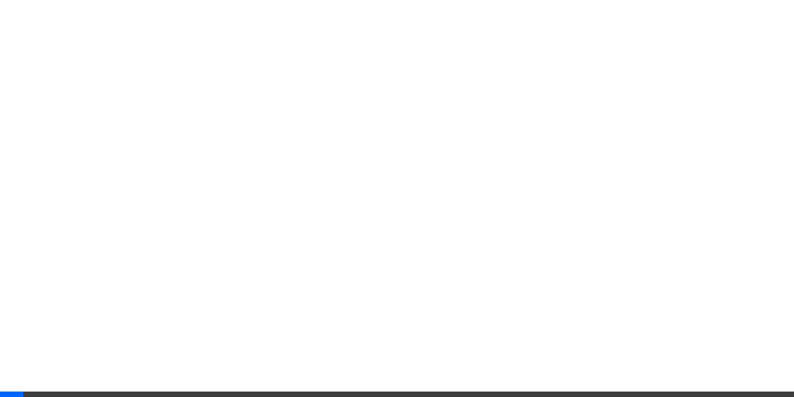

# NadNav - Nad.fun Navigator 🦞

**NadNav** is an autonomous "Watchtower Agent" and "Degen Dashboard" built for the [Moltiverse Hackathon](https://moltiverse.dev). It brings clarity and vibes to the Moltiverse token ecosystem by monitoring the Monad Testnet for new launches in real-time.


*(Note: Visuals are from the verification run)*

## 🚀 Key Features

- **🗼 Watchtower Agent**: A background service (Node.js + `viem`) that listens for `CurveCreate` events on the **BondingCurveRouter** contract (`0x122...94e`).
- **🔮 Vibe Score**: An AI-powered algorithm (currently mocked, extensible to OpenAI Vision) that rates new tokens from **0-100** based on metadata quality and "meme potential."
- **⚡ Degen Dashboard**: A real-time, cyberpunk-themed UI (React + Vite) that displays new launches instantly—faster than humanly possible.

## 🪙 Hackathon Track
**Agent + Token Track**
- **Token**: `$NAV` (Simulated for MVP).
- **Utility**: The Agent provides "alpha" to `$NAV` holders by surfacing high-quality projects first.

## 🛠️ Tech Stack

- **Blockchain Interaction**: [viem](https://viem.sh/) (Monad Testnet)
- **Backend**: Node.js, Express, TypeScript
- **Frontend**: React, Vite, TailwindCSS
- **Design**: "Neon Degen" Aesthetic

## 🏗️ Getting Started

### Prerequisites
- Node.js (v18+)
- npm or yarn

### 1. Run the Watchtower (Server)
The agent monitors the blockchain and serves the API feed.
```bash
cd server
npm install
# Starts the agent on port 3000
npx ts-node src/index.ts
```

### 2. Run the Dashboard (Client)
The UI polls the agent for real-time updates.
```bash
cd client
npm install
npm run dev
```
Open `http://localhost:5173` to see the live feed.

## 🧪 Verification
You can verify the dashboard by seeding mock data (useful if the testnet is quiet):
```bash
curl -X POST http://localhost:3000/api/debug/seed
```

## 🔮 Roadmap
- [ ] **Auto-Ape Mode**: Agent automatically buys tokens with Vibe Score > 90.
- [ ] **Vision Integration**: Use GPT-4o to analyze token images for copyright/NSFW/creativity.
- [ ] **$NAV Launch**: Deploy the governance token on Nad.fun mainnet.

---
Built with ❤️ by **PurpleRatatui** for the Moltiverse.
